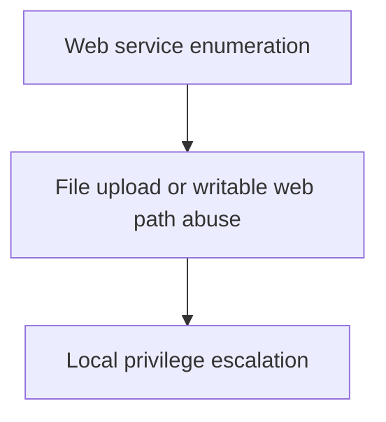

# Recon Revenant Report

## Attack Chain
1. Web service enumeration
2. File upload or writable web path abuse
3. Local privilege escalation

## Enumeration Signals
- OS: linux
- Services: http, ssh
- Filesystem: web_writable_dir
- PrivEsc: suid_env
- Tokens: None
- Services Misconfig: None

## Likely Missed Enumeration
- Credential discovery for SSH access

## Attack Flow Diagram

## Exam Takeaways
- Follow signals, not guesswork
- Privilege mechanics matter more than exploits
- Enumeration depth determines success

---
Generated using **local offline AI**. No data left the system.
