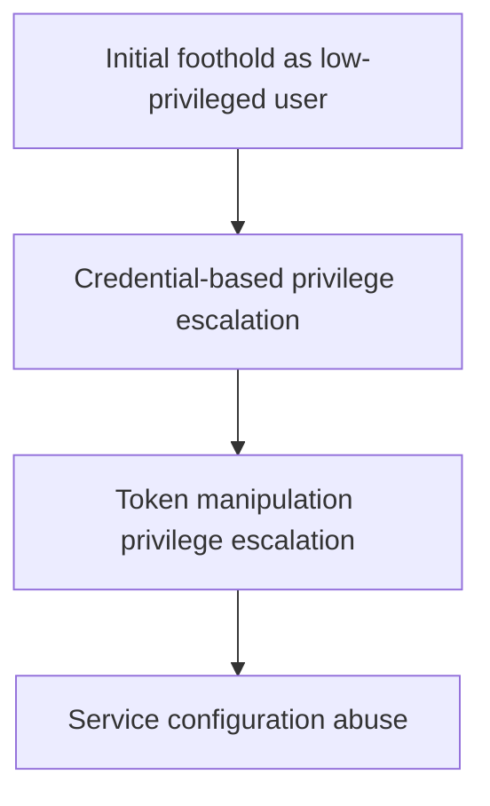

# Recon Revenant Report

## Attack Chain
1. Initial foothold as low-privileged user
2. Credential-based privilege escalation
3. Token manipulation privilege escalation
4. Service configuration abuse

## Enumeration Signals
- OS: windows
- Services: smb
- Filesystem: None
- PrivEsc: None
- Tokens: se_impersonate
- Services Misconfig: unquoted_service_path

## Likely Missed Enumeration

## Attack Flow Diagram

## Exam Takeaways
- Follow signals, not guesswork
- Privilege mechanics matter more than exploits
- Enumeration depth determines success